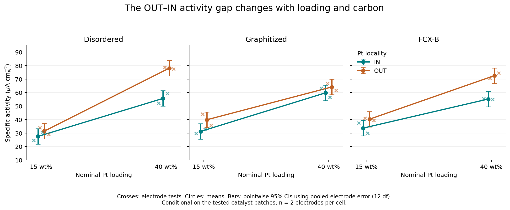

# Factorial analysis of electrocatalyst activity

A reproducible Python study of how nominal Pt loading, carbon support, and Pt locality relate to specific activity in a **2 × 3 × 2 experimental layout**.

The project connects scientific questions to effect estimates, interaction plots, ANOVA, and uncertainty. It includes a teaching notebook, reusable analysis code, the supplied dataset, and generated figures and tables.

**Scope:** 24 observations represent two separately prepared electrode tests of each of 12 catalyst samples. They are not independent catalyst syntheses. The statistical calculations compare these tested samples against electrode-level variation; they do not establish synthesis-level reproducibility or causal effects.



## Research questions

1. How does average specific activity differ between nominal 15 and 40 wt% Pt loading?
2. How does the OUT − IN activity difference depend on loading and carbon support?
3. Which conclusions depend on uncertainty, the comparison family, or the response scale?

## Selected results

Activity units are interpreted as µA/cm²Pt; see the [data dictionary](data/README.md).

| Quantity | Estimate | Pointwise 95% CI |
|---|---:|---:|
| Average nominal 40 − 15 wt% difference | +30.27 | 26.95 to 33.58 |
| Average OUT − IN difference | +10.55 | 7.24 to 13.86 |
| OUT − IN, Disordered at 40 wt% | +22.45 | 14.34 to 30.56 |
| OUT − IN, FCX-B at 40 wt% | +17.37 | 9.25 to 25.48 |

The OUT − IN gap for Disordered carbon changes from 3.90 at low loading to 22.45 at high loading. This motivates explicit interaction contrasts instead of relying on averages alone. All intervals pool conditional electrode error across cells.

Loading × carbon, loading × locality, and the three-factor interaction have raw omnibus p-values of approximately 0.0196, 0.0178, and 0.0284. Their Holm-adjusted p-values across seven factorial terms are approximately 0.0889. Some interaction patterns also weaken on the log-SA scale. These results are exploratory; the project retains those limitations rather than presenting all nominally small p-values as discoveries.

## What this project demonstrates

- Translating an experimental question into factors, levels, and interactions.
- Data validation without silently changing the supplied response.
- OLS-based factorial ANOVA with explicit contrast coding.
- Effect estimates in physical units, confidence intervals, and multiple-testing adjustment.
- Residual diagnostics and response-scale sensitivity analysis.
- Independent verification of sums of squares and contrast direction.
- Clear reporting of experimental units, confounding, and limits of inference.

## Start here

Open [the executed notebook](notebooks/01_factorial_anova.ipynb) to read the analysis without installing anything. GitHub can display its saved tables and figures. For a detailed explanation, read [the theory and code walkthrough](docs/theory-and-walkthrough.md).

For local work, use Python 3.12. In PowerShell, from this project folder:

```powershell
py -3.12 -m venv .venv
.\.venv\Scripts\python.exe -m pip install -r requirements.txt
.\.venv\Scripts\python.exe src\analyze.py
```

This uses the virtual environment's interpreter directly, so PowerShell script activation is unnecessary. On macOS/Linux:

```bash
python3.12 -m venv .venv
.venv/bin/python -m pip install -r requirements.txt
.venv/bin/python src/analyze.py
```

To work through the notebook in VS Code, open this folder, open the `.ipynb`, and select `.venv` as the Python kernel. Alternatively install JupyterLab in the same environment and launch it:

```powershell
.\.venv\Scripts\python.exe -m pip install jupyterlab
.\.venv\Scripts\python.exe -m jupyterlab
```

The committed `requirements.txt` pins the direct analysis/notebook dependencies used to execute this project. `outputs/run_info.json` records the numerical library versions. The requirements are not a full lockfile of transitive dependencies.

## Project files

| Path | Purpose |
|---|---|
| `data/catalyst_activity.csv` | Original 24 observations |
| `data/README.md` | Variables, assumed units, provenance, and replicate design |
| `notebooks/01_factorial_anova.ipynb` | Executed, guided lesson |
| `src/analyze.py` | Reusable functions and command-line analysis |
| `scripts/execute_notebook.py` | Execute all notebook cells in one IPython session |
| `docs/theory-and-walkthrough.md` | Theory, worked examples, and communication guidance |
| `docs/github-setup.md` | Windows instructions to create the public repository |
| `outputs/figures/` | Interaction plot, contrast intervals, and diagnostics |
| `outputs/tables/` | ANOVA, contrasts, cell means, sensitivity, and data audit |
| `.github/workflows/analysis.yml` | Re-run the analysis and notebook on GitHub |

## Model and analysis choices

```python
model = ols(
    "SA ~ C(Loading_level, Sum) * C(Carbon, Sum) * C(Locality, Sum)",
    data=df,
).fit()
anova_lm(model, typ=3)
```

All main effects and interactions are retained. Type III tests use sum contrasts to represent equal-weight marginal comparisons in this balanced complete design. The model has 12 parameters and 12 residual degrees of freedom. Measured loading is retained but is not substituted for nominal loading or added to the saturated categorical model as a supposedly independent adjustment.

Raw p-values and Holm-adjusted p-values are exported for three explicitly separate families: seven omnibus terms, six locality contrasts, and three carbon-specific difference-of-differences. Confidence intervals are pointwise. The log-response fit is a sensitivity analysis and changes the scientific question from absolute to proportional effects.

The analysis verifies that the full model's fitted values equal the 12 observed cell means, the manual orthogonal SS decomposition matches statsmodels, all SS add to total centered variation, and model-based locality contrasts match direct mean differences. The script and all 25 notebook code cells have been executed locally. Saved notebook outputs were generated sequentially in one in-process IPython session using `python scripts/execute_notebook.py`; no notebook server is needed for this route. The GitHub workflow will run after upload.

## Scientific limits

Two electrodes per sample give very limited information about error shape and cell-specific variance. A common electrode variance and independent conditional errors are assumptions, not established facts. Batch variation is unmeasured. Actual Pt loadings differ between nominally matched IN/OUT samples. Carbon identity is not a mechanistic measurement of pore structure or surface chemistry. SA is derived from MA and ECSA; these should not be inserted as independent predictors of their own ratio without a different modeling rationale.

More independent catalyst batches, matched measured loading, intermediate loading levels, and experimental metadata would improve the next study. Additional electrode tests alone would not resolve all these limitations.

## References

- [NIST: multi-factor ANOVA](https://www.itl.nist.gov/div898/handbook/eda/section3/eda355.htm)
- [NIST: residual assumptions](https://www.itl.nist.gov/div898/handbook/pri/section2/pri245.htm)
- [statsmodels: interactions and ANOVA](https://www.statsmodels.org/stable/examples/notebooks/generated/interactions_anova.html)
- [statsmodels: multiple-testing adjustments](https://www.statsmodels.org/stable/generated/statsmodels.stats.multitest.multipletests.html)

Dataset supplied by Alessio Cosenza. Educational and exploratory analysis; numerical results should be reconciled with laboratory records before manuscript use.
